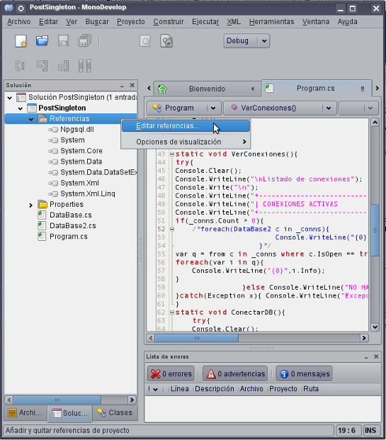
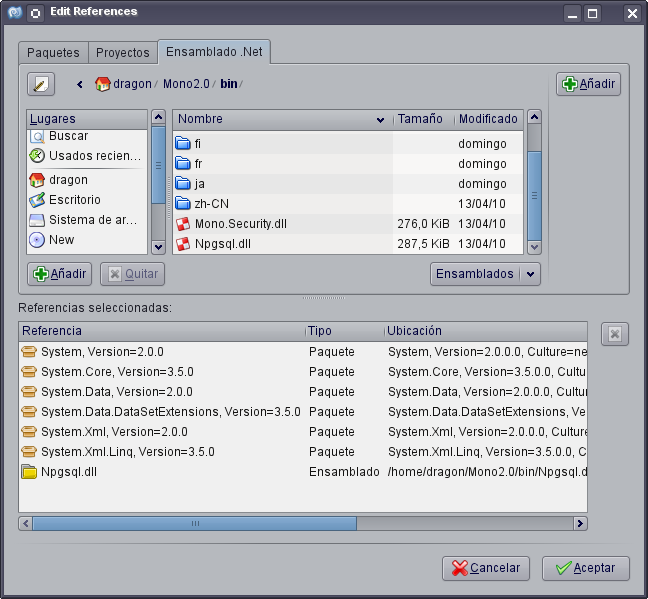
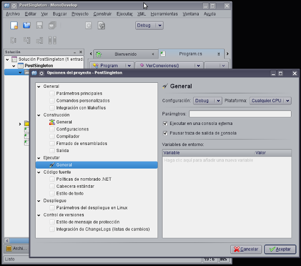
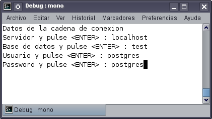
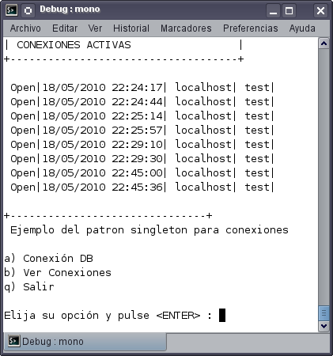
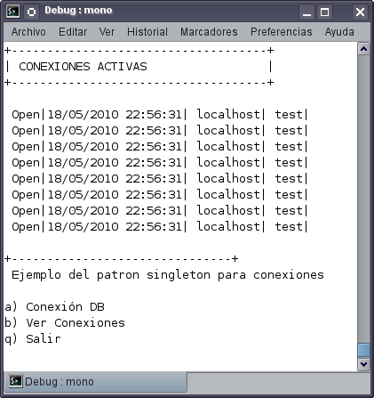

# El patrón singleton con Monodevelop y PostgreSQL

En el ejemplo anterior mostré como utilizar patrón Singleton con conexiones a bases de datos SQL Server ejecutándonse bajo Microsoft Windows, ahora mostraré las modificaciones que tuve que realizar a ese ejemplo para que funcione con PostgreSQL como base de datos y Linux como sistema operativo.

Primeramente abrí el proyecto en Monodevelop, después descargue la última versión de la biblioteca Npgsql para tener actualizado los últimos cambios de esta biblioteca, lo cuál es recomendable ya que además de arreglar los errores el equipo responsable agrega nuevas funcionalidades, una vez descargada la biblioteca comence con las siguientes modificaciones: 

1-.Quitar la referencia al ensamblado de Sql Server (System.Data.SqlClient) y reemplazarlo por el de PostgreSQL (Npgsql), esto se hace dentro del explorador de la solución, haciendo click derecho sobre las referencias como se muestra en la imagen.

Nos aparecerá la ventana "edit references", ahí escogemos la pestaña que dice "Ensamblado .Net" para buscar en el sistema de archivos en la ruta donde descargamos y descomprimimos la biblioteca Npgsql,esto para seleccionar el ensamblado Npgsql.dll como se muestra en la siguiente imagen.

2-. Reemplazar en el código de las clases DataBase y DataBase2 respectivamente el namespace System.Data.SqlClient por Npgsql using System.Data.SqlClient; por using Npgsql;

3-. También en el código de esas clases reemplazar las líneas donde se hace la declaración del objeto que representa la conexión y donde se realiza la creación de dicho objeto, reemplazar las siguientes líneas:

SqlConnection _conn = null;
_conn = new SqlConnection();
por
NpgsqlConnection _conn = null;
_conn = new NpgsqlConnection();

4-. En estas mismas clases cambiar el tipo de excepción en el catch del try del metódo GetConnection(). catch(SqlException x) por catch(NpgsqlException x)

5-. Reemplazar el evento StateChange del objeto NpgsqlConnection y el delegado asociado al evento, por una propiedad de tipo string que infome de las características de la conexión, esto debido a que aún el proveedor de datos de postgreSQL no cuenta con esta característica.

<pre>
StateChange += delegate(object o,StateChangeEventArgs args){
    Info = String.Format(" {1}| {2}| {3}|",args.CurrentState.ToString(),System.DateTime.Now.ToLocalTime(),
_conn.DataSource,_conn.Database);
por
Info = String.Format(" {0}|{1}| {2}| {3}|",GetCurrentState,System.DateTime.Now.ToLocalTime(),
_conn.DataSource ,_conn.Database);
</pre>
Agregando la siguiente propiedad
<pre>
public string GetCurrentState{ get {return (IsOpen == true ? "Open" : "Closed");}}
</pre>

Terminando los cambios debemos de configurar MonoDevelop para que al ejecutar la aplicación el programa se ejecute en una terminal propia y no en la ventana de salida (output) de MonoDevelop, esto se hace en el menú principal en la opción "Proyecto" eligiendo el submenú "Opciones", nos mostrará una pantalla como la siguiente imagen.

Después de estos cambios podemos observar el resultado, de forma idéntica al resultado logrado en la plataforma Microsoft.Ingreso de los parámetros de conexión.

Sin el uso del patrón Singleton, cambian los tiempos en la conexión

Usando el patrón Singleton, el tiempo es único.

